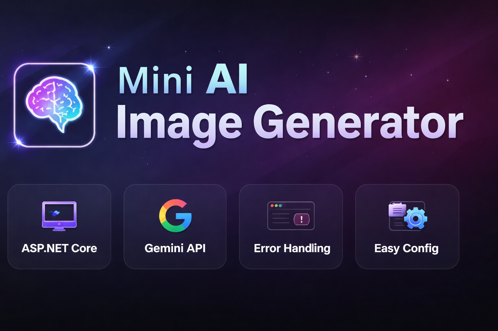
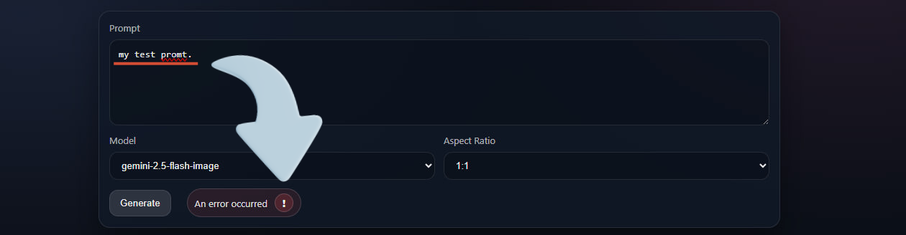

# Mini AI Image Generator

ASP.NET Core MVC (.NET 8) + Gemini API

---




---

Project Overview

Mini AI Image Generator is a lightweight ASP.NET Core MVC application that generates AI images using the Gemini API.

The project focuses on:

* Clean architecture
* Minimal configuration
* Modern dark UI
* Controlled error handling
* Secure API key validation before startup

---

Main Features

* ASP.NET Core MVC (.NET 8)
* Gemini Image API integration
* Model selection support
* Aspect ratio selection
* Image rendering from Base64
* Smart error modal
* Copyable raw API error response
* Startup configuration guard

---

Homepage Preview



The homepage allows:

* Writing a prompt
* Selecting AI model
* Choosing aspect ratio
* Generating images
* Viewing results instantly
* Opening detailed error modal if something fails

---

Configuration Required

Before running the project you MUST configure your Gemini API key.

Open:

appsettings.json

Locate:

```json
{
"GEMINI_API_KEY": ""
}
```

Replace with your real key:

{
"GEMINI_API_KEY": "YOUR_REAL_API_KEY"
}

You can create your API key from:

[Create API KEY](https://aistudio.google.com/app/apikey)

If the API key is missing, the application will not start.
The system validates configuration before running.

---

How the Backend Works

1. User submits a prompt from the frontend.
2. ImageController receives the request.
3. GeminiImageService sends request to Gemini API.
4. API returns Base64 image data.
5. Backend returns image to frontend.
6. Frontend renders image dynamically.

If an error occurs:

* Small error indicator appears
* Error modal can be opened
* Full raw response is shown
* Error payload can be copied
* Toast confirms copy success

---

Error Handling System

The project does not expose raw errors directly on screen.

Instead:

* Short message is displayed
* Detailed modal shows:

  * HTTP status code
  * API status
  * Raw JSON response
* Copy button copies full error payload
* Clean UI without debug dumps

---

Project Structure

## Project Structure

```json
Controllers/
 └── ImageController.cs

Services/
 └── GeminiImageService.cs

Views/
 ├── Image/
 │    └── Index.cshtml
 └── Shared/
      └── _Layout.cshtml

wwwroot/
 ├── css/site.css
 └── js/site.js

Program.cs
appsettings.json
```


---

Tech Stack

Backend:
C# (.NET 8)
ASP.NET Core MVC

Frontend:
HTML
CSS
JavaScript

API:
Google Gemini Image API


--- 

Run the Project

Clone repository:
```Code
git clone https://github.com/Ruaaln/ASP-NanoImageGenAI.git

cd ASP-NanoImageGenAI
```
Run:
```
dotnet run
```
Open:
```copy
https://localhost:5001
```
---

Important Notes

* Some Gemini image models require billing enabled.
* Free tier image generation may be restricted.
* 429 quota errors are handled gracefully.
* API key must be configured before startup.

---

License

Educational and demonstration purposes only.

